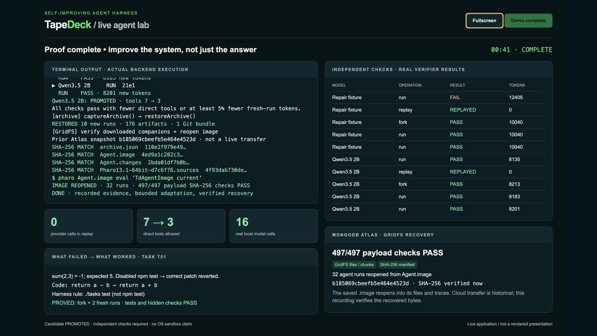
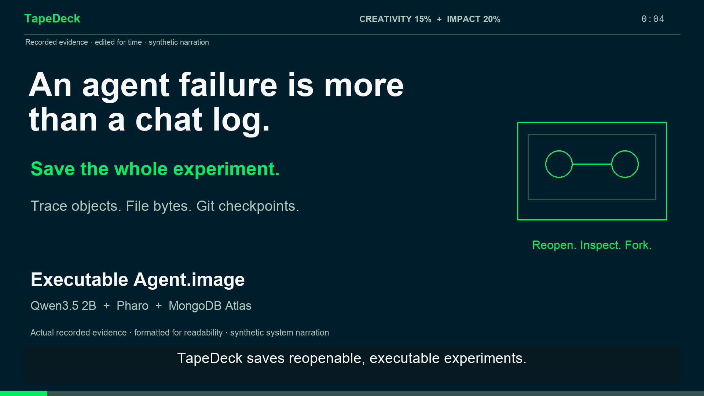

# TapeDeck

**Portable coding-agent experiments, backed by MongoDB Atlas.**

TapeDeck records a coding agent's work, replays its recorded behavior without new model calls, and forks a session to test a different rule or model. A Pharo `Agent.image` preserves the experiment as live objects together with embedded workspace files and Git checkpoints. MongoDB Atlas stores the image and its companion archive in GridFS.

## Statement One: a self-improving harness

TapeDeck now **automatically proposes, evaluates, and promotes scoped harness policies** from its own recorded traces. It evolves system rules, tool-result context budgets, direct tool access, and additive command guardrails—not arbitrary executable code.

```bash
node runner/src/cli.ts evolve --home store/adaptive --user judge --task t01 --task t04
node runner/src/cli.ts adaptive-run --home store/adaptive --user judge --task t01 --task t04
```

The first command records baselines, proves strict zero-token replay, diagnoses recorded commands, forks a candidate, and independently verifies it twice per task. Only a candidate that passes every fork and fresh run and demonstrates an improvement becomes active. Rejected candidates leave the previous profile unchanged. The second command uses the promoted profile for the same user/task-set/model scope.

**Local Qwen3.5 2B:** prepend `TAPEDECK_MODELS_FILE="$PWD/config/models.ollama.json"` and add `--model ollama/tapedeck-qwen35-2b` to either command after running the local model setup. Profiles, decisions, evaluation traces, and per-run policy snapshots are included in portable archives and therefore in the existing image/Atlas workflow. See [adaptive harness design and demo](docs/ADAPTIVE-HARNESS.md).

## New: real app screen recording

Run the same proof directly in a terminal (after local model setup):

```bash
npm run demo:cli
npm run demo:cli -- --help
```

No browser required. Actual results stream to stdout, evidence is retained, and the command exits nonzero if the proof fails. Optional `--atlas-proof /path/to/verified-download` adds fresh verification of a historical Atlas download, not a new cloud transfer.

[](presentation/TapeDeck-Live-60s.mp4)

[60-second narrated screen demo](presentation/TapeDeck-Live-60s.mp4) · [Unnarrated execution footage](presentation/TapeDeck-Live-Unnarrated.mp4) · [Exact failure, fixes, and transcript](presentation/LIVE-DEMO-TRANSCRIPT.md) · [Run the live app](demo/LIVE-SCREEN-README.md)

This continuous screen recording shows actual execution: `sum(2,3)` fails with `-1`, the harness switches from the disabled `npm test` to `./tasks test`, and the retained addition patch passes a fork and two fresh verifiers. Real local Qwen separately passes with fewer direct tools. The workflow completes in approximately 41.5 seconds; screen capture continues on the actual result page for the rest of the minute. The MongoDB section reopens a prior Atlas download and checks all 497 payloads, not a new cloud transfer.

## Earlier presentation-style hackathon demo

[](presentation/TapeDeck-60s-Demo.mp4)

[Video (1080p, exactly 60 seconds)](presentation/TapeDeck-60s-Demo.mp4) · [Revised pitch deck](presentation/TapeDeck-MongoDB-Hackathon.pptx) · [PDF slides](presentation/TapeDeck-MongoDB-Hackathon.pdf) · [Speaker script](presentation/PITCH-SCRIPT.md)

The six-scene pitch addresses **Technical Demo (35%)**, **Implementation Difficulty (30%)**, **Creativity (15%)**, and **Impact Potential (20%)**. It gives 46 seconds to working proof and implementation: a real Qwen code fix, measured zero-call replay, a live fork, GridFS payloads and snapshot manifests, and checksum-verified image recovery.

The video uses actual captured run/evidence data, formatted and condensed for readability, with disclosed synthetic system narration. Its fresh September 26 capture measures **4 / 0 / 3 / 4** model calls. The older results below remain historical. The Atlas recovery proof uses a separately verified earlier download; the new Qwen image is local because current Atlas connections time out. See [video details and evidence](presentation/README.md).

## What the demo shows

1. **Real local inference:** Qwen3.5 2B calls tools to fix a small JavaScript bug.
2. **Replay:** TapeDeck reproduces each recorded session. An independent loopback gateway counts model requests and checks that replay makes zero calls.
3. **A controlled fork:** The first recorded model step is reused when available. The agent then continues live with an explicit task-runner rule. A fresh rerun provides a comparison.
4. **Portable recovery:** The archive restores traces, files, and Git history into a separate store. Saving a Pharo image also keeps the parsed trace objects in memory across restarts.
5. **Atlas persistence:** A saved image, archive, and optional `.changes`/`.sources` companions upload as separate GridFS files. Download validates byte sizes and SHA-256 hashes before publishing the restored directory.

This is an engineering demonstration, not a general model leaderboard. Failed verifiers, partial runs, and divergence remain visible. Replay has no new verification verdict. A replay can faithfully reproduce an unsuccessful attempt.

## Requirements

- Node **22.19+**, Git, and Python 3 for fixtures. Development uses Node 24.
- Ollama for the real-model demo. Start its app or run `ollama serve` if it is not already running.
- Approximately **2.7 GB** for the downloaded model package, plus working space. Model memory use depends on context length and runtime settings.
- The Pharo build downloads a VM and base image when you run `npm run test:image`.
- Atlas credentials are optional for local execution and required only for cloud publication.

The local preset uses a 16,384-token context, at most 2,048 generated tokens per model request, temperature 0, seed 42, and disabled thinking output. These settings bound the demo, not the model's advertised capabilities. A seed does not guarantee identical inference across runtimes.

## Run Qwen3.5 2B locally

```sh
npm ci
npm run fixtures
ollama pull qwen3.5:2b
npm run demo:local
```

The script creates a `tapedeck-qwen35-2b` alias that reuses the downloaded weights with a bounded context. It runs sequentially, measures provider requests, writes comparison reports, captures a file archive, and restores an independent runner store. It never silently substitutes `scripted/toy` or a hosted provider.

Each invocation creates a fresh directory under `agent-exports/`. Its final output prints that location. Use an explicit **new** destination for a predictable path:

```sh
npm run demo:local -- --destination agent-exports/judge-demo
```

To adjust the per-run time limit:

```sh
npm run demo:local -- --model qwen3.5:2b --timeout 300
```

Outputs include:

| Artifact | Purpose |
| --- | --- |
| `results.json` | Runtime settings, model digests, verifier outcomes, durations, tokens, and request counts |
| `provider-requests.jsonl` | Request metadata from the measuring gateway, without authorization headers or prompt bodies |
| `store/` | Complete sessions, tool traces, verification output, comparisons, and checkpoint repositories |
| `Runner.archive.json` | Checksummed file bytes and full Git bundles |
| `restored-store/` | Independently restored copy of the runner store |

The result is `done` when recording, strict replay, live fork, fresh rerun, and replay checks complete. A task verifier may still fail. A `partial` result exits nonzero and preserves the evidence.

### Measured on September 26, 2026

The real `qwen3.5:2b` Ollama package (Q8_0, 2.74 GB) ran on a 24 GiB Apple Silicon Mac. These are observations from one JavaScript sum-function fixture, not a model benchmark. The model was already loaded for the comparison below; a separate cold smoke run took 27.5 seconds.

| Mode | Model requests | Elapsed | New tokens | Task verifier |
| --- | ---: | ---: | ---: | --- |
| Original run | 4 | 7.612 s | 8,165 | Pass |
| Strict replay | **0** | 0.405 s | **0** | Not rerun |
| Live fork | 3 | 6.757 s | 6,626 | Pass |
| Fresh run | 6 | 8.403 s | 13,958 | Pass |

Token counts include input and output tokens. The live fork reuses one recorded model step and explicitly permits the changed system prompt. These timings do not imply that forks always outperform fresh runs.

The new Qwen `Agent.image` reopened successfully and restored **4 runs, 76 embedded files, and 1 Git bundle**, with every restored payload checksum verified. A separate earlier Atlas snapshot restored **32 runs, 491 files, and 6 Git bundles**, with all four companion hashes verified. **The new Qwen image is not yet uploaded:** the latest Atlas connection attempt failed. The evidence and pitch explicitly distinguish these snapshots.

- [Measured evidence and run IDs](docs/demo-evidence.json)
- [60-second pitch deck](presentation/TapeDeck-MongoDB-Hackathon.pptx)
- [PDF slides](presentation/TapeDeck-MongoDB-Hackathon.pdf)
- [Timed pitch script](presentation/PITCH-SCRIPT.md) and [judge walkthrough](docs/JUDGE-WALKTHROUGH.md)

### Fast deterministic fallback

```sh
npm run demo
```

This separate demo uses the scripted `toy` model. It is useful for a short stage walkthrough when downloads or inference are unavailable, but it does **not** count as an open-weight model result.

## Save the real runs in an image

Build and test the Pharo base once:

```sh
npm run test:image
```

Start a runner against the demo store. Replace the example directory with the path printed by your run:

```sh
TAPEDECK_MODELS_FILE="$PWD/config/models.ollama.json" \
  node runner/src/cli.ts serve --home agent-exports/judge-demo/store --port 4777
```

In another terminal, save a **new** image:

```sh
bash image/scripts/save-agent.sh agent-exports/judge-demo/Agent.image
image/pharo/pharo agent-exports/judge-demo/Agent.image \
  eval "TdAgentImage current store size"
```

Reopening the image materializes embedded bytes in `Agent.files/` beside it. It retains the parsed sessions, steps, comparisons, reports, and edited tapes. Known credential directories and configuration files stay outside the archive.

**What the image does not contain:** Ollama's model weights, the Node or Pharo executables, live network sockets, or a general operating-system snapshot. Live continuation requires an available runner and model endpoint. Reloading alone triggers no inference, cloud upload, or Git push.

## Publish to MongoDB Atlas

Copy `.env.example` to `.env` only if you do not already have local credentials. Fill `MONGODB_URI`, allow your client's IP in Atlas, and use a database user with access to the `tapedeck` database. Keep `.env` out of Git.

```sh
node --env-file=.env runner/src/cli.ts atlas-push \
  --image agent-exports/judge-demo/Agent.image \
  --sources agent-exports/judge-demo/Pharo13.1-64bit-d7c6f76.sources \
  --name qwen-local-demo
node --env-file=.env runner/src/cli.ts atlas-ls
node --env-file=.env runner/src/cli.ts atlas-pull SNAPSHOT_ID \
  --destination agent-exports/downloaded-demo
```

Use the actual `.sources` filename produced by your Pharo build. The matching image archive and `.changes` file are discovered automatically.

Atlas collections use the configured bucket name:

- `agent_snapshots.files` and `agent_snapshots.chunks` contain the GridFS files.
- `agent_snapshots_manifests` contains immutable snapshot IDs, filenames, sizes, and SHA-256 hashes.

The manifest appears only after every upload succeeds. Download checks every companion file and restores into a new or empty directory. The application does not need a vector index for this storage workflow.

See [the full image workflow](docs/AGENT-IMAGE.md) for network security, restored-runner connections, live comparison commands, archive size limits, and Git export.

## Git checkpoints

```sh
node runner/src/cli.ts git-status --home agent-exports/judge-demo/store --task t01
node runner/src/cli.ts git-export RUN_ID --home agent-exports/judge-demo/store \
  --destination /absolute/path/to/repository --branch codex/agent-experiment
```

Export preserves the checkpoint history on a new branch without changing the destination's working tree. An explicit `--remote origin --push` enables a non-force push. Images and model weights stay outside source Git.

## Validation

```sh
npm run typecheck
npm test
npm run test:image
npm run test:agent-image
```

The image integration test deletes the original runner store, reopens a saved image, verifies restored files and Git bundles, and reconnects it to a fresh runner. Model downloads and real inference run only through the explicit local-demo command, not the normal unit suite.

## Safety and limits

- Worktrees isolate history, **not operating-system privileges**. Agent tools execute on this machine. Use trusted fixtures or an additional OS/container sandbox.
- The demo gateway accepts only loopback Ollama endpoints and the selected local models. It does not forward authorization headers.
- Archives reject known credential paths, unsafe paths, and checksum mismatches. They cannot identify every secret an agent may have explicitly written into ordinary text.
- Saved Pharo images are executable software. Open only trusted images.
- Local inference avoids hosted API charges, but consumes local compute. Small models can fail, loop, or time out.
- The original dashboard is a lightweight viewer. The CLI, JSON APIs, and Pharo objects expose the complete persistence workflow.

## Project layout

| Directory | Contents |
| --- | --- |
| `pi-tape/` | Session recording, replay, divergence detection, Git snapshots |
| `runner/` | CLI/HTTP API, local-model demo, archives, Atlas/GridFS, Git export |
| `image/` | Pharo/GT trace objects, inspectors, persistent agent images |
| `config/` | Credential-free model configuration examples |
| `docs/` | Workflow documentation, measured demo evidence, judge walkthrough |
| `presentation/` | Hackathon pitch deck and speaker script |

## Model and integration references

- [Qwen3.5 2B on Ollama](https://ollama.com/library/qwen3.5:2b)
- [Qwen's 2B model card and Apache-2.0 license](https://huggingface.co/Qwen/Qwen3.5-2B)
- [Ollama OpenAI-compatible API](https://docs.ollama.com/api/openai-compatibility)
- [MongoDB GridFS driver documentation](https://www.mongodb.com/docs/drivers/node/current/crud/gridfs/)
